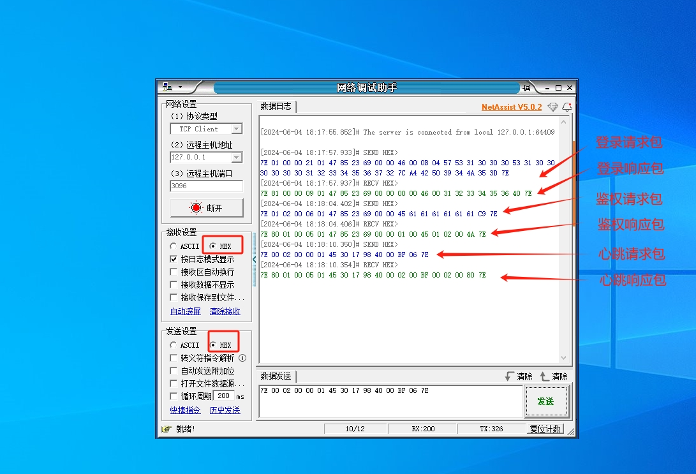
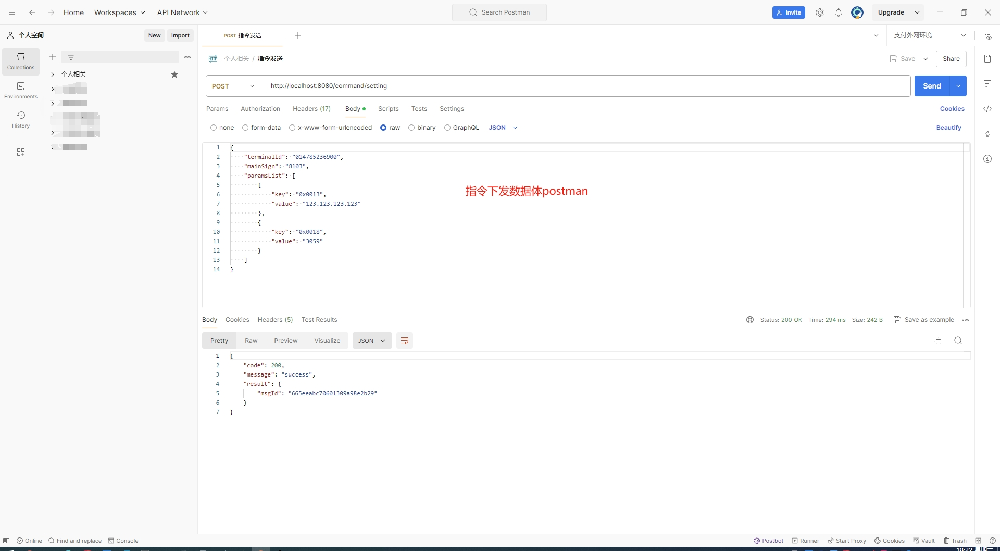
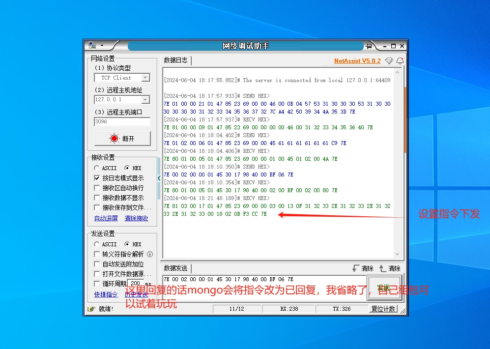
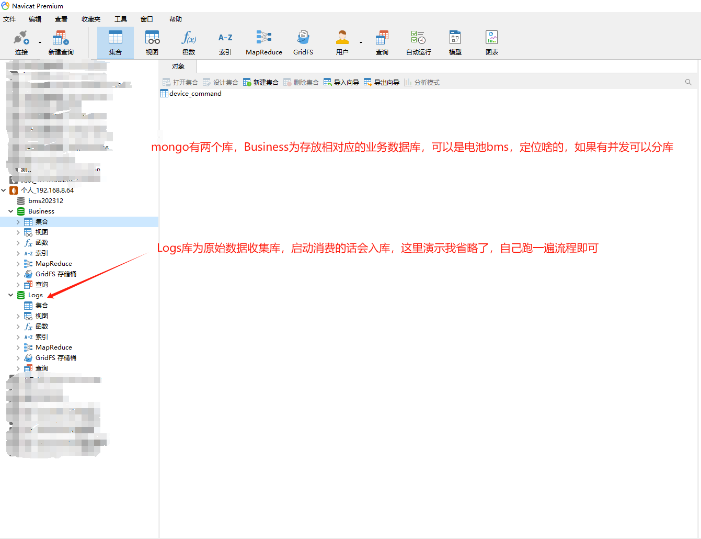

### 演示流程
```
前置条件为部署好mongo、rabbitmq、redis三件套，配置文件也改好。
下载项目tools中的发包工具

1.启动jzx-jt808-hardware项目
2.启动jzx-jt808-process项目
3.启动jzx-jt808-web项目
```

### 演示过程截图
```
1.在工具中发登录包
2.在工具中发鉴权包
3.在工具中发心跳包
```


### 演示指令下发
```
1.启动jzx-jt808-web项目
2.用postman发数据
url为：http:/localhost:8080/command/setting (依据个人部署改变)
```
提交的数据为：
```json
{
    "terminalId": "014785236900",
    "mainSign": "8103",
    "paramsList": [
        {
            "key": "0x0013",
            "value": "123.123.123.123"
        },
        {
            "key": "0x0018",
            "value": "3059"
        }
    ]
}
```



### 查看工具收到的设置指令数据


### 查看mongo相关数据


### 后记
个人觉得此框架只是一个抛砖引玉的效果。

有能力的话可以想一下怎么做hardware项目横向扩容，当前版本未考虑做横向扩容。

开源此项目也是为了帮助大家学习，希望大家能提出一些意见，一起进步。

如果需要解答问题，请为知识付费。

企鹅群：发邮件获取 hncdyj123#163.com